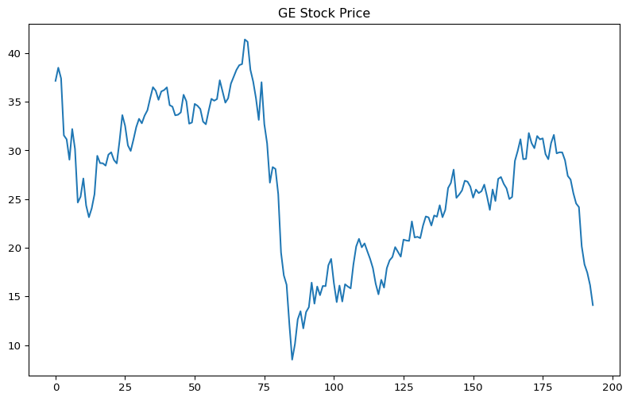
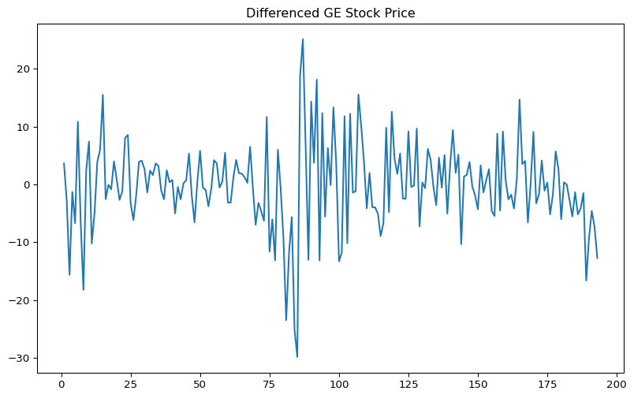
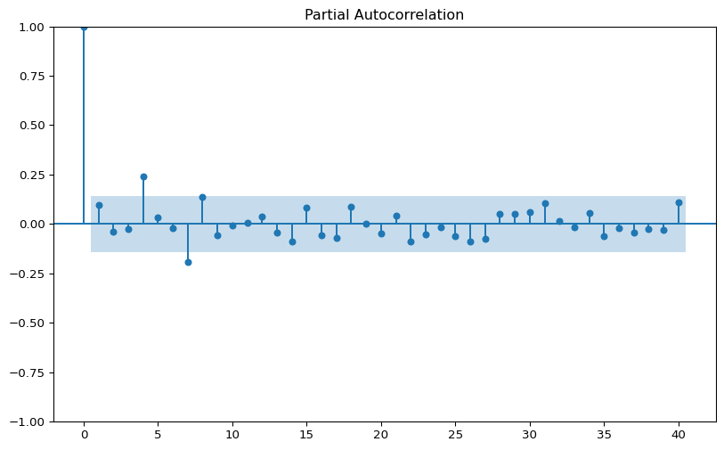
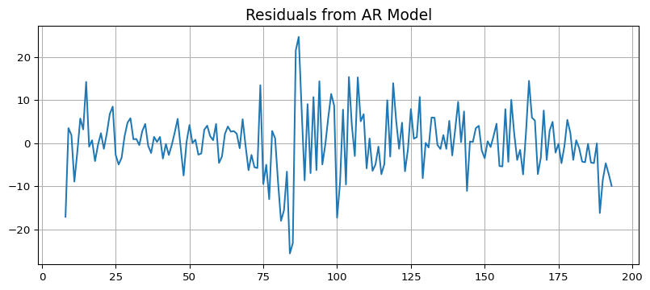
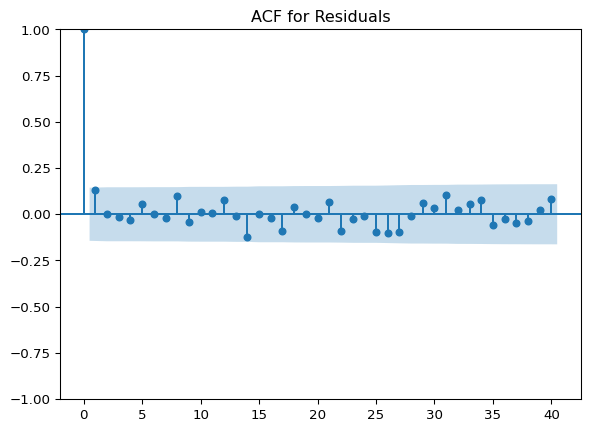
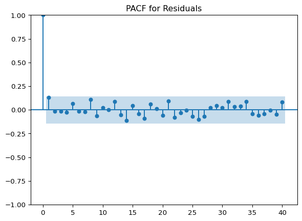
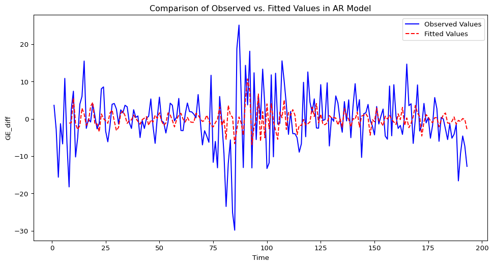

# Estimating Autoregressive (AR) Models

To estimate an Autoregressive (AR) model for the General Electric (GE)
stock price, we can use the statsmodels library in Python. The steps to
do so include loading the data, visualizing it, performing stationarity
tests, determining the order of the AR model, and finally estimating the
model. Below is a step-by-step guide and Python code to accomplish this
task.

## Step 1: Import Libraries and Load Data

First, we need to import necessary libraries and load the data from the
CSV file.

``` python
import pandas as pd
import numpy as np
import matplotlib.pyplot as plt
from statsmodels.tsa.stattools import adfuller, acf, pacf
from statsmodels.tsa.ar_model import AutoReg
from statsmodels.graphics.tsaplots import plot_pacf, plot_acf

# Load the dataset
df = pd.read_csv('data/capm.csv')
df.head()
```

|     | Date   | SANDP       | FORD  | GE        | MICROSOFT | ORACLE    | USTB3M |
|-----|--------|-------------|-------|-----------|-----------|-----------|--------|
| 0   | Jan-02 | 1130.199951 | 15.30 | 37.150002 | 31.855000 | 17.260000 | 1.68   |
| 1   | Feb-02 | 1106.729980 | 14.88 | 38.500000 | 29.170000 | 16.620001 | 1.76   |
| 2   | Mar-02 | 1147.390015 | 16.49 | 37.400002 | 30.155001 | 12.800000 | 1.83   |
| 3   | Apr-02 | 1076.920044 | 16.00 | 31.549999 | 26.129999 | 10.040000 | 1.75   |
| 4   | May-02 | 1067.140015 | 17.65 | 31.139999 | 25.455000 | 7.920000  | 1.76   |


## Step 2: Visualize the Data

Visualizing the GE stock price to understand its behavior over time.

``` python
df['GE'].plot(title='GE Stock Price', figsize=(10, 6))
plt.show()
```



### Step 3: Test for Stationarity

Before estimating an AR model, we need to ensure that the time series is
stationary. We use the Augmented Dickey-Fuller (ADF) test for this
purpose.

``` python
result_adf = adfuller(df['GE'], autolag='AIC')
print(f'ADF Statistic: {result_adf[0]}')
print(f'p-value: {result_adf[1]}')
```

    ADF Statistic: -1.8355727211649129
    p-value: 0.3629492469787401

If the p-value is greater than 0.05, the series is not stationary, and
we may need to difference the series and perform the test again.

Based on the result of this test, we can conclude that the series is not
stationary so we need to first difference the series and test again:

``` python
# df['GE_diff'] = df['GE'].diff()
df["GE_diff"] = df["GE"].pct_change() * 100


# Drop the NaN value created by differencing
df = df.dropna()

result_adf = adfuller(df['GE_diff'], autolag='AIC')
print(f'ADF Statistic: {result_adf[0]}')
print(f'p-value: {result_adf[1]}')
```

    ADF Statistic: -4.051148422228882
    p-value: 0.001165136499938297

Testing again for stationary, we reject the null hypothesis of
non-stationarity. Therefore, the series is stationary in first
difference.

Let’s visualize the new differenced series:

``` python
df['GE_diff'].plot(title='Differenced GE Stock Price', figsize=(10, 6))
plt.show()
```



As we can see, the series seems to move randomly around a constant mean,
which it is indicative of stationarity.

## Step 4: Determine the Order of the AR Model

We use the Partial Autocorrelation Function (PACF) to help determine the
order of the AR model.

``` python
# Plot PACF
fig, ax = plt.subplots(figsize=(10, 6))
plot_pacf(df['GE_diff'], lags=40, ax=ax)
plt.show()
```



The number of lags that crosses the confidence interval is an indication
of the order of the AR model. In this case, the 4th and 7th lag seem to
be significant, and perhaps the 8th as well.

## Step 5: Estimate the AR Model

After determining the order, we can estimate the AR model using the
AutoReg function from statsmodels.

Based on the previous PACF, it seems like lags 4, 7, and maybe 8, are
significant.

Let’s first add all lags up to the 8th to test for significance:

``` python
# Assuming the order determined from PACF plot is p
p = 8  # Example order, replace with actual determined order
model = AutoReg(df['GE_diff'], lags=8)
model_fitted = model.fit()

print(model_fitted.summary())
```

                                AutoReg Model Results                             
    ==============================================================================
    Dep. Variable:                GE_diff   No. Observations:                  193
    Model:                     AutoReg(8)   Log Likelihood                -620.415
    Method:               Conditional MLE   S.D. of innovations              6.922
    Date:                Sun, 12 May 2024   AIC                           1260.830
    Time:                        07:55:36   BIC                           1293.033
    Sample:                             8   HQIC                          1273.881
                                      193                                         
    ==============================================================================
                     coef    std err          z      P>|z|      [0.025      0.975]
    ------------------------------------------------------------------------------
    const         -0.0268      0.509     -0.053      0.958      -1.025       0.971
    GE_diff.L1     0.1317      0.072      1.828      0.068      -0.010       0.273
    GE_diff.L2    -0.0023      0.071     -0.032      0.974      -0.142       0.137
    GE_diff.L3    -0.0087      0.071     -0.123      0.902      -0.147       0.130
    GE_diff.L4     0.1974      0.070      2.801      0.005       0.059       0.335
    GE_diff.L5     0.0098      0.071      0.138      0.890      -0.130       0.150
    GE_diff.L6    -0.0049      0.071     -0.069      0.945      -0.144       0.134
    GE_diff.L7    -0.2029      0.071     -2.870      0.004      -0.341      -0.064
    GE_diff.L8     0.1430      0.072      1.985      0.047       0.002       0.284
                                        Roots                                    
    =============================================================================
                      Real          Imaginary           Modulus         Frequency
    -----------------------------------------------------------------------------
    AR.1           -1.1282           -0.0000j            1.1282           -0.5000
    AR.2           -0.8106           -0.9414j            1.2423           -0.3631
    AR.3           -0.8106           +0.9414j            1.2423            0.3631
    AR.4            0.1402           -1.1410j            1.1495           -0.2305
    AR.5            0.1402           +1.1410j            1.1495            0.2305
    AR.6            1.2314           -0.7850j            1.4604           -0.0903
    AR.7            1.2314           +0.7850j            1.4604            0.0903
    AR.8            1.4253           -0.0000j            1.4253           -0.0000
    -----------------------------------------------------------------------------


Based on the previous results, let’s estimate again by adding just the
significant lags (which is congruent with the PACF plot above):

``` python
# Assuming the order determined from PACF plot is p
model = AutoReg(df['GE_diff'], lags=[4, 7])
model_fitted = model.fit()

print(model_fitted.summary())
```

                                AutoReg Model Results                             
    ==============================================================================
    Dep. Variable:                GE_diff   No. Observations:                  193
    Model:              Restr. AutoReg(7)   Log Likelihood                -629.293
    Method:               Conditional MLE   S.D. of innovations              7.130
    Date:                Sun, 12 May 2024   AIC                           1266.586
    Time:                        07:55:36   BIC                           1279.489
    Sample:                             7   HQIC                          1271.814
                                      193                                         
    ==============================================================================
                     coef    std err          z      P>|z|      [0.025      0.975]
    ------------------------------------------------------------------------------
    const         -0.1099      0.523     -0.210      0.834      -1.135       0.915
    GE_diff.L4     0.2263      0.070      3.224      0.001       0.089       0.364
    GE_diff.L7    -0.2038      0.070     -2.899      0.004      -0.342      -0.066
                                        Roots                                    
    =============================================================================
                      Real          Imaginary           Modulus         Frequency
    -----------------------------------------------------------------------------
    AR.1            1.1891           -0.4590j            1.2746           -0.0586
    AR.2            1.1891           +0.4590j            1.2746            0.0586
    AR.3            0.1961           -1.1760j            1.1923           -0.2237
    AR.4            0.1961           +1.1760j            1.1923            0.2237
    AR.5           -1.1629           -0.0000j            1.1629           -0.5000
    AR.6           -0.8038           -1.0867j            1.3517           -0.3514
    AR.7           -0.8038           +1.0867j            1.3517            0.3514
    -----------------------------------------------------------------------------

<br>

**Analyze the resuts using p-values for the significance test** and decide which lags are significant.

<br>

Let’s analyze the residuals from this last estimation:

``` python
# Plot residuals
residuals = model_fitted.resid
plt.figure(figsize=(10, 4))
plt.plot(residuals)
plt.title('Residuals from AR Model', fontsize=14)
plt.grid(True)
plt.show()

plot_acf(residuals, lags=40, title='ACF for Residuals')
plt.show()

plot_pacf(residuals, lags=40, title='PACF for Residuals')
plt.show()

# Run the Ljung-Box Test: A significant result (p < 0.05 typically) suggests there is autocorrelation in the residuals
# which is undesirable. That is, the null hypothesis is no autocorrelation.

from statsmodels.stats.diagnostic import acorr_ljungbox

print(acorr_ljungbox(residuals, lags=[10], return_df=False))
```







         lb_stat  lb_pvalue
    10  6.378516   0.782523

Based on the plots above, we can say that there is no autocorrelation in
the residuals, therefore, our AR model successfully control for
autocorrelation.

Additionally, based on the Ljung-Box test, we also conclude that there
is no autocorrelation anymore.

## Step 6: Forecasting

Finally, let’s do some forecasting for the next 5 periods after the last
available observation:

``` python
# Replace steps with the number of future steps you want to predict
forecast = model_fitted.forecast(steps=5)
print(forecast)
```

    193   -1.365660
    194   -0.842158
    195    1.618217
    196   -1.102726
    197    0.517009
    dtype: float64


We can also compared in a plot the observed vs the fitted or forecasted
values:

``` python
fitted_values = model_fitted.fittedvalues

plt.figure(figsize=(12, 6))
plt.plot(df['GE_diff'], label='Observed Values', color='blue')
plt.plot(fitted_values, label='Fitted Values', color='red', linestyle='--')
plt.title('Comparison of Observed vs. Fitted Values in AR Model')
plt.xlabel('Time')
plt.ylabel('GE_diff')
plt.legend()
plt.show()
```


